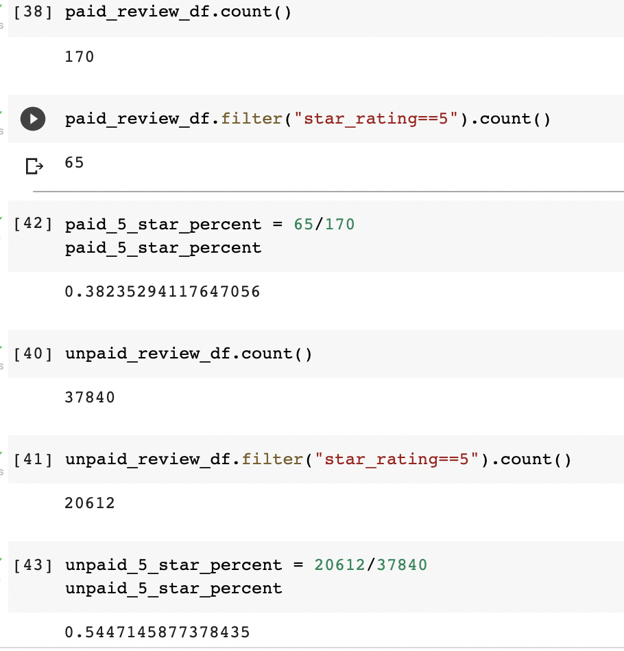

# Amazon Vine Review Analysis

## Analysis Overview
The purpose of the analysis was to utilize Pyspark to load a dataset of Amazon product reviews and determine if there was any bias toward favorable reviews from Vine members (a paid Amazon program). 

For my analysis, I chose to load in a dataset of reviews for pet supply products. After initializing my Spark session, I loaded the dataset and created a dataframe using the following code:
```
from pyspark import SparkFiles
url = "https://s3.amazonaws.com/amazon-reviews-pds/tsv/amazon_reviews_us_Pet_Products_v1_00.tsv.gz"
spark.sparkContext.addFile(url)
df = spark.read.option("encoding", "UTF-8").csv(SparkFiles.get(""), sep="\t", header=True, inferSchema=True)
df.show()
```

After this step, I created a new dataframe with the columns I needed to perform my comparison analysis. This dataframe was then filtered to include reviews that had more than 20 votes in order to pick reviews that are more likely to be helpful:
```
total_votes_df = df.filter("total_votes>=20")
total_votes_df.show()
```

I further filtered the data to include reviews where the number of helpful votes compared to the total number of votes was greater than 50%:
```
helpful_votes_df = total_votes_df.filter((total_votes_df["helpful_votes"]/total_votes_df["total_votes"])>=0.5)
helpful_votes_df.show()
```

Finally, I could then filter these helpful reviews based on whether the reviews were written by paid users (Vine members) or unpaid users (non-Vine members):
```
paid_review_df = helpful_votes_df.filter(helpful_votes_df["vine"] == 'Y')
paid_review_df.show()

unpaid_review_df = helpful_votes_df.filter(helpful_votes_df["vine"] == 'N')
unpaid_review_df.show()
```

With the reliable reviews filtered by paid vs. unpaid, I could then run my analysis to determine any bias toward favorable reviews between the two groups.

## Results
How many Vine reviews and non-Vine reviews were there?
  - For the pet supply review data set, there were more non-Vine reviews than Vine reviews
  - Vine review total: 170
  - non_Vine review total: 37,840

How many Vine reviews were 5 stars? How many non-Vine reviews were 5 stars?
  - Of the 170 Vine reviews, 65 were 5 star reviews
  - Of the 20,612 non_Vine reviews, 20,612 were 5 star reviews

What percentage of Vine reviews were 5 stars? What percentage of non-Vine reviews were 5 stars?
  - The percentage of Vine reviews with 5 stars was 38.24%
  - The percentage of non-Vine reviews with 5 stars was 54.47%

The code that determined these findings can be viewed here:


## Summary
Based on the analysis, it can be determined that there is no positivity bias for Vine program reviews compared to non-Vine reviews, given that the percentage of 5-star reviews for Vine members was less than the 5-star review percentage for non-Vine members.

An additional analysis to consider to confirm this result could be to perform a Chi-squared test between the frequency of 5-star reviews for Vine vs. non-Vine reviews to determine if there is a statistically significant difference in frequency of 5-star reviews between the two groups.
